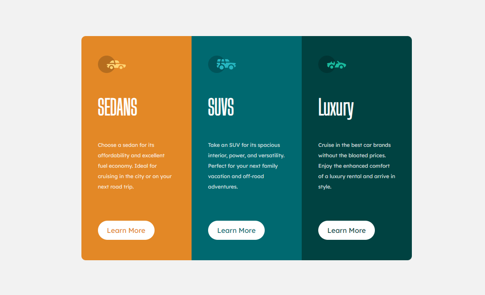

Challenge Front-End :  Rendre la page Responsive

Difficulté : CSS Grid Lay Out, le rendre responsive :

1er Résultat : 

2nd Résultat : Lorsque la page est en dessous de 375px de largeur:

En bonus les boutons Learn More ==> 

